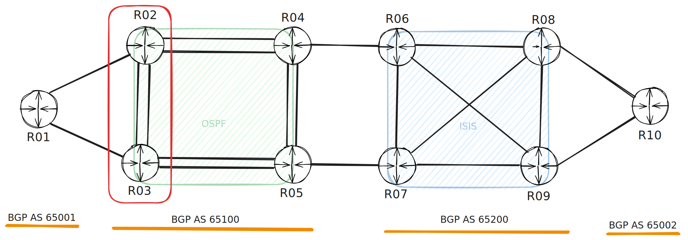
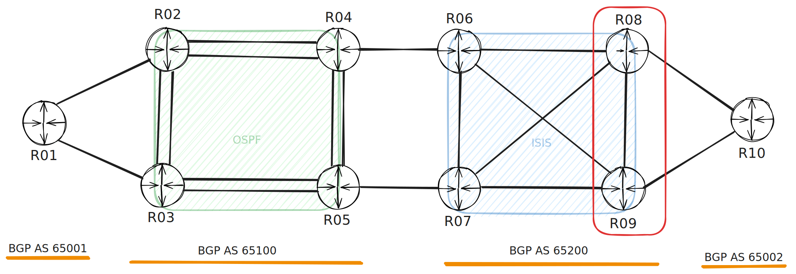
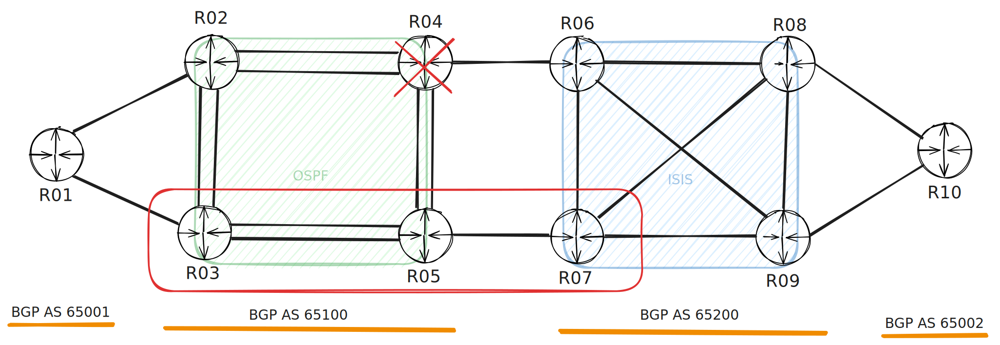
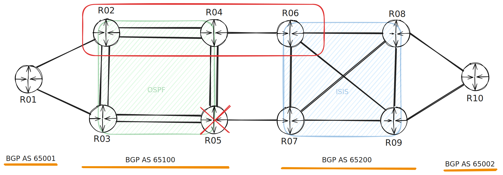
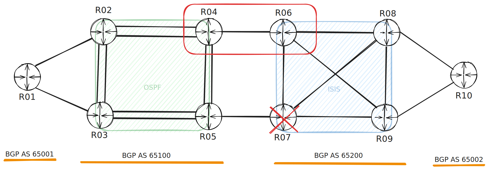
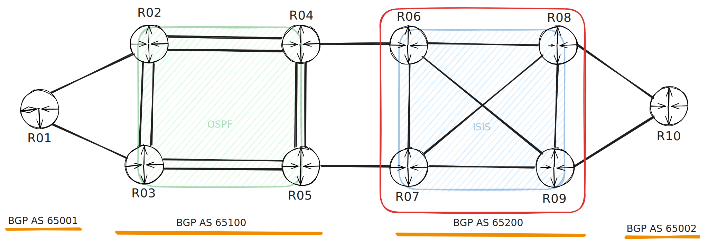
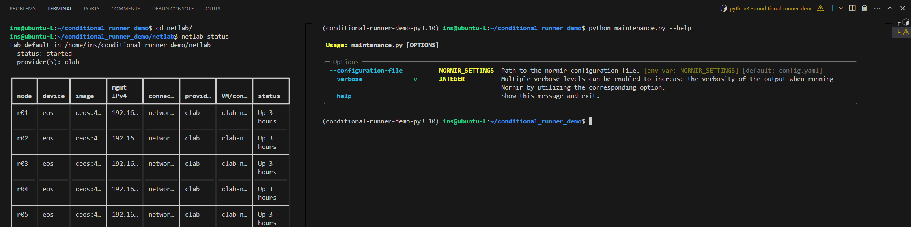
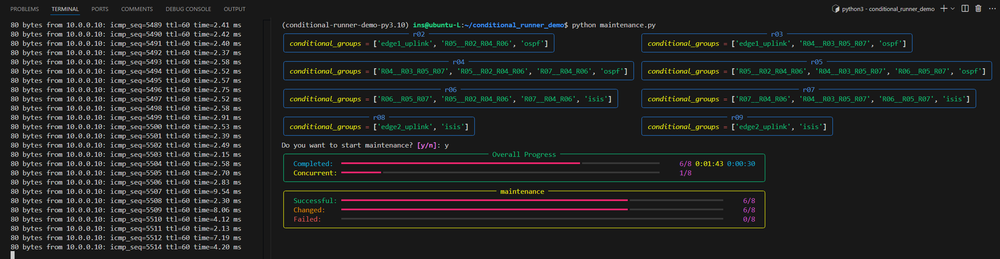
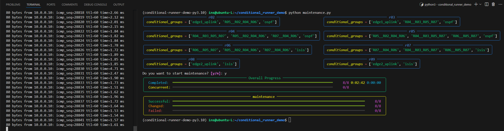
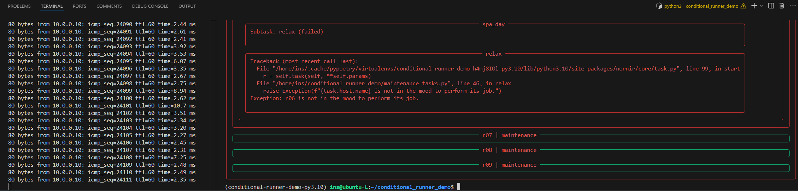

# Conditional Runner Day

We believe every router deserves a spa day! In this example, each router gets a well-deserved beauty rest of 10 to 30 seconds. During this time, the router's ISIS and OSPF processes are temporarily shut down.

With [`nornir-conditional-runner`](https://github.com/InfrastructureAsCode-ch/nornir_conditional_runner), you can ensure that R01 **Loopback0 always** maintains connectivity to **R10 Loopback0**, even while routers are taking their breaks.

## Video

[](https://youtu.be/var8vgZ4gGY)


## Conditions

### edge1_uplink

**R02** and **R03** cannot be down simultaneously; otherwise, R01 will lose connectivity.



### edge2_uplink

**R08** and **R09** cannot be down simultaneously; otherwise, R10 will lose connectivity.



### R04 (R04__R03_R05_R07)

If **R04** is down, **R03**, **R05**, and **R07** cannot also be down.



### R06 (R06__R05_R07)

If **R06** is down, **R05** and **R07** cannot also be down.


### R05 (R05__R02_R04_R06)

If R05 is down, **R02**, **R04**, and **R06** cannot also be down.



### R07 (R07__R04_R06)

If **R07** is down, **R04** and **R06** cannot also be down.



### OSPF

A maximum of **one** router in the OSPF group can be down at any time.


### ISIS

A maximum of **two** routers in the ISIS group can be down at any time.




## Runner Configuration

The runner configuration in the Nornir settings is defined as follows:

```yaml
runner:
  plugin: ConditionalRunner
  options:
    num_workers: 10
    conditional_group_key: "conditional_groups"
    group_limits:
      edge1_uplink: 1
      edge2_uplink: 1
      R04__R03_R05_R07: 1
      R06__R05_R07: 1
      R05__R02_R04_R06: 1
      R07__R04_R06: 1
      ospf: 1
      isis: 2
```

Each host needs to have the `conditional_groups` attribute defined. Using `SimpleInventory`, the configuration for host **R04** would look like this:

```yaml
r04:
  hostname: 192.168.121.104
  groups:
    - eos
    - ospf
  data:
    conditional_groups:
      - R04__R03_R05_R07
      - R05__R02_R04_R06
      - R07__R04_R06
      - ospf
```

## Lab

The lab environment is created by [netlab](https://netlab.tools/) and can be easily started with the following steps:

```bash
cd netlab
netlab up
```

## Credentials

The [`load_credentials`](https://nornir.tech/nornir_utils/html/tutorials/load_credentials.html) from nornir-utils is used.

```bash
export NORNIR_PASSWORD=admin
```

### Prerequisites

Ensure you have [netlab and containerlab installed](https://netlab.tools/labs/clab/) and properly configured.
Navigate to the netlab directory containing your lab configuration files before running the command.

The lab has been tested on Ubuntu with the following system specifications:
- 16GB RAM
- 4 vCPUs


## Screenshots

- Help

- Running

- Success

- Failed
